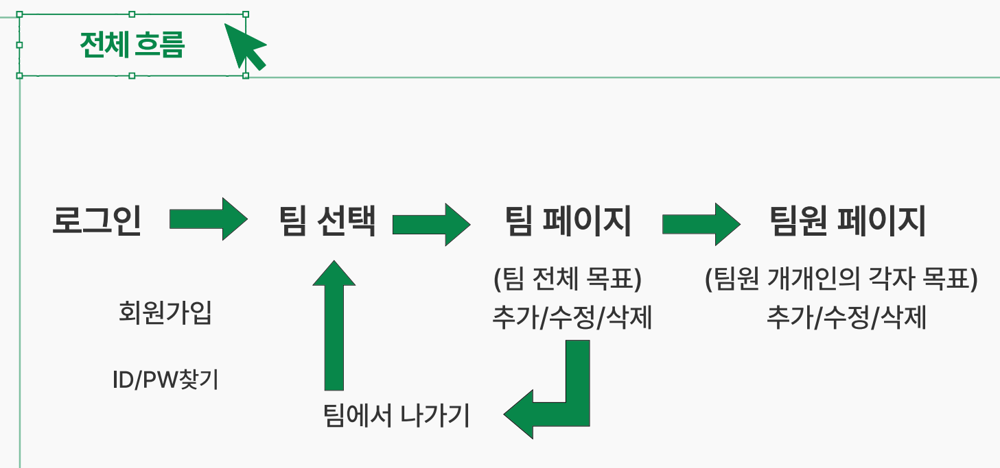

# 정글에서 살아남기 - 팀 페이지 통합관리 서비스
## Team 4 project

## About Project
* 팀 전체의 업무 진행 상황과 내 업무의 진행 상황을 함께 관리해주는 웹 사이트 제작
* 5개월간의 업무를 하나의 웹사이트에서 확인 가능

## Wireframe 
[figma prototype](https://www.figma.com/proto/PN81WhfIARYKsArRyWvNYI/team4_project1?node-id=2-4&starting-point-node-id=2%3A4).

## Pipe line


## Installation
```bash
pip install -r requirements.txt
```
```bash
bcrypt==4.0.1
blinker==1.6.3
cffi==1.16.0
click==8.1.7
colorama==0.4.6
cryptography==41.0.4
dnspython==2.4.2
Flask==3.0.0
Flask-JWT-Extended==4.5.3
Flask-Login==0.6.2
itsdangerous==2.1.2
Jinja2==3.1.2
MarkupSafe==2.1.3
pycparser==2.21
PyJWT==2.8.0
pymongo==4.5.0
python-dotenv==1.0.0
Werkzeug==3.0.0
```

## Directory tree
```bash
│  .gitignore
│  app.py
│  requirements.txt
│  tree.txt
│  
├─static
│      index.js
│      title.png
│      
└─templates
        create_team.html
        forgot_pwd.html
        index.html
        login.html
        pop.html
        select_team.html
        target_list.html
        target_team_list.html
        team_page.html
```
